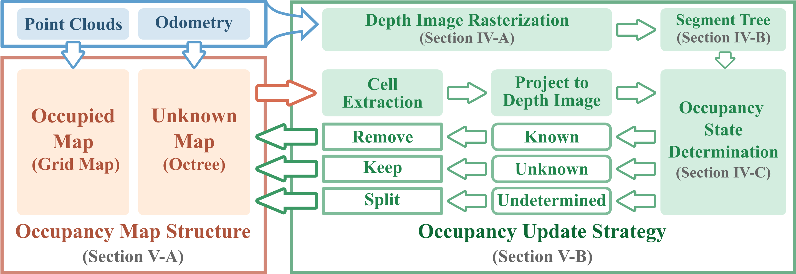

# D-Map: Occupancy Grid Mapping Framework without Ray-Casting for High-resolution LiDAR Sensors

## Introduction
**D-Map** is an efficient occupancy mapping framework for high-resolution LiDAR sensors. The framework introduces three main novelties to address the computational efficiency challenges of occupancy mapping.

- D-Map uses a depth image to determine the occupancy state of regions instead of the traditional ray-casting method. 
- D-Map utilizes an efficient on-tree update strategy on a tree-based map structure. These two techniques avoid redundant visits to small cells, significantly reducing the number of cells to be updated. 
- D-Map removes known cells from the map at each update by leveraging the low false alarm rate of LiDAR sensors. This approach not only enhances our framework's update efficiency by reducing map size but also endows it with an interesting decremental property.

## Framework Overview



The map structure of D-Map consists of two parts: the occupied map and the unknown map. The green block represents the pipeline of the occupancy update strategy. At each update, a depth image is rasterized from the incoming point clouds at the sensor pose. Subsequently, a 2-D segment tree is constructed on the depth image to enable efficient occupancy state determination. The cell extraction module retracts the unknown cells on the octree from the largest to the smallest size, projects them to the depth image, and determines their occupancy states. The cells determined as known are directly removed from the map, while the unknown ones remain, and the undetermined ones are split into smaller cells for further occupancy state determination. 

## Accompanying Video

The video showcasing two real-world applications is available on [Youtube](https://youtu.be/c3dz-WsyohY)

## Our paper

The preprint version will be released on arxiv soon.

## Build & Run demo
### 1. How to build this project
```bash
cd ~/catkin_ws/src
git clone git@github.com:hku-mars/D-Map.git
cd ..
catkin_make
source devel/setup.bash
```
### 2. Run rosbag examples
#### 2.1 Workshop Dataset
- Please download our Workshop dataset via [google drive](https://drive.google.com/file/d/1dbfx9w1tMUrPm7kloF0LSZVorRE8ruoZ/view?usp=sharing).
- Run the example launch with rosbag as follows:

```bash
roslaunch dmap DMap_example.launch
rosbag play workshop.bag
```
#### 2.2 Kitti Dataset
- We provide an example to run D-Map on spinning LiDARs using the 04 sequence in [Kitti Dataset for Odometry Evaluation](https://www.cvlibs.net/datasets/kitti/eval_odometry.php). Please download the rosbag from [google drive](https://drive.google.com/file/d/1AOFcfXf62vhC9g5V--TZQzzBuKPXLtsR/view?usp=sharing) which includes the velodyne laser data and ground truth odometry. 
- Run the velodyne launch with rosbag as follows:
```bash
roslaunch dmap DMap_velodyne.launch
rosbag play kitti_04.bag
```
## Guidelines for Sensor Settings

## License
The source code of D-Map is released under [GPLv2](http://www.gnu.org/licenses/old-licenses/gpl-2.0.html) license. For commercial use, please contact Mr. Yixi CAI (<yixicai@connect.hku.hk>) or Dr. Fu ZHANG (<fuzhang@hku.hk>).